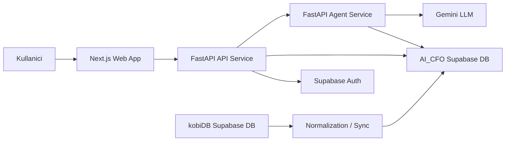

# AI CFO Platformu

AI CFO Platformu; KOBI'lerin finansal verilerini, pazarlama performansini, nakit akislarini, risk sinyallerini ve karar destek ihtiyaclarini tek bir yapay zeka destekli calisma alaninda birlestiren full-stack bir SaaS MVP'sidir.

## Proje Ozeti

Kullanici sisteme giris yaptiktan sonra sirket calisma alanina baglanir, dashboard uzerinden finansal ozetleri gorur ve AI CFO sohbet ekraninda dogal dilde finansal sorular sorabilir.

Ornek sorular:

- "Sirketimin nakit durumu nasil?"
- "Son 30 gunde pazarlama harcamalarim verimli mi?"
- "En acil 3 finansal aksiyonum ne?"
- "Reklam butcesini yuzde 20 azaltirsam nakit akisim nasil etkilenir?"

## Mimari



## Klasor Yapisi

```text
ai-cfo-platform/
  apps/
    api/              FastAPI gateway, auth, dashboard, ask and simulation routes
    agent_service/    Intent routing, LangGraph orchestration and AI CFO agents
    web/              Next.js frontend
  packages/
    contracts/        Shared request/response models
    shared/           Shared constants, prompts and utilities
  infrastructure/
    docker/           Service Dockerfiles
    scripts/          Local run scripts
    sql/              SQL migration placeholders
    normalization/    Source-to-AI-CFO normalization workflow
    seeds/            Seed/utility entrypoints
  docs/               Architecture, data flow, agent design and MVP notes
```

## Servisler

### API Service

Konum: `apps/api`

Ana sorumluluklar:

- Supabase Auth login ve kullanici context cozumleme
- Dashboard verisi ve refresh akisi
- Frontend ile agent service arasinda gateway
- Analiz ve simulasyon isteklerini yonlendirme

Baslica endpointler:

```text
POST /auth/login
GET  /auth/me
POST /ask
GET  /dashboard/overview
POST /simulations/run
GET  /health
```

### Agent Service

Konum: `apps/agent_service`

Ana sorumluluklar:

- Kullanici sorusunu intent'e ayirma
- Full-chain akista cashflow ve marketing agentlarini paralel calistirma
- Risk ve CFO agentlarini domain ciktilarindan sonra calistirma
- Her agent icin standart output contract uretme: metrics, flags, summary, confidence, data_coverage, errors
- Metrik hesaplama, LLM ozeti uretme ve agent sonucunu kaydetme
- Dogal dil ve yapilandirilmis simulasyonlari calistirma

### Web App

Konum: `apps/web`

Ana ekranlar:

```text
/               Karsilama ekrani
/signin         Giris
/dashboard      Finans dashboard
/text-generator AI CFO sohbeti
```

## Kurulum

Gereksinimler:

- Python 3.11+
- Node.js 20+
- npm
- Supabase projesi
- Gemini API key

### Python

```powershell
cd C:\Users\ELIF\Desktop\project_2026\ai-cfo-platform
python -m venv .venv
.\.venv\Scripts\activate
python -m pip install --upgrade pip
pip install -r apps/api/requirements.txt
pip install -r apps/agent_service/requirements.txt
```

### Frontend

```powershell
cd C:\Users\ELIF\Desktop\project_2026\ai-cfo-platform\apps\web
npm install
```

## Ortam Degiskenleri

Ornek dosyalar:

```text
apps/api/.env.example
apps/agent_service/.env.example
apps/web/.env.example
```

Gercek `.env` dosyalari lokal kalmalidir ve repoya gonderilmemelidir.

## Calistirma

Her servis ayri terminalde calistirilir.

```powershell
cd C:\Users\ELIF\Desktop\project_2026\ai-cfo-platform
$env:PYTHONPATH="C:\Users\ELIF\Desktop\project_2026\ai-cfo-platform"
python -m uvicorn apps.agent_service.app.main:app --host 0.0.0.0 --port 8001 --reload
```

```powershell
cd C:\Users\ELIF\Desktop\project_2026\ai-cfo-platform
$env:PYTHONPATH="C:\Users\ELIF\Desktop\project_2026\ai-cfo-platform"
python -m uvicorn apps.api.app.main:app --host 0.0.0.0 --port 8000 --reload
```

```powershell
cd C:\Users\ELIF\Desktop\project_2026\ai-cfo-platform\apps\web
npm run dev
```

Adresler:

```text
Web:           http://localhost:3000
API:           http://localhost:8000/health
Agent Service: http://localhost:8001/health
```


## Dokumantasyon

Detayli notlar `docs/` altindadir:

- `docs/architecture.md`
- `docs/data_flow.md`
- `docs/database_design.md`
- `docs/agent_design.md`
- `docs/demo_scenario.md`
- `docs/mvp_scope.md`

## Guvenlik Notu

Asagidaki bilgiler public repoya veya yarismaya acik sekilde gonderilmemelidir:

```text
Supabase service role key
Gemini API key
JWT secret
.env dosyalari
```
