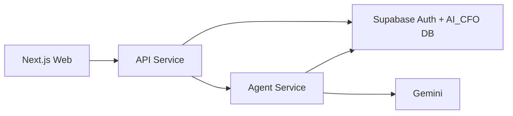

# Architecture

The platform is split into three runtime services:

- `apps/web`: Next.js frontend and API route proxy layer.
- `apps/api`: FastAPI gateway for auth, dashboard, ask and simulation operations.
- `apps/agent_service`: FastAPI service for intent routing, analytics and AI CFO response generation.

The backend services share response contracts from `packages/contracts/python`. Supabase is used for authentication and application data. Gemini is used by the agent service for language-model summaries and CFO-level recommendations.

